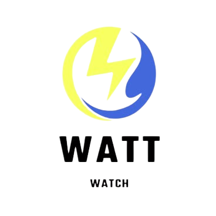

# WattWatch - Water and Electricity Tracking App

## Introduction

Welcome to WattWatch, your partner in saving resources, money, and the environment. WattWatch is an innovative app that revolutionizes the way you monitor and manage your electricity and water consumption. With WattWatch, you can take control of your bills and make a significant impact on the environment.

The Project is built as the part of Smart India Hackathon 2023.

## Table of Contents

- [Features](#features)
- [How It Works](#how-it-works)
- [Versions](#versions)
- [Contribution](#contribution)

## Features

### 1. Monthly Goal Setting

Set monthly consumption goals for electricity and water to keep your bills under control. WattWatch will notify you if you're exceeding your goals.

### 2. Deep Analytics

Gain insights into your usage patterns with detailed analytics. Identify areas where you can reduce consumption and save money.

### 3. Green Points

Earn Green Points every time you save electricity and water. Redeem them for coupons and use them to pay future bills. Your actions benefit both your wallet and the environment.

### 4. Device Usage Tracking

Track how long each device runs to become more aware of your consumption habits. Get a breakdown of usage by device.

### 5. Insights for Manufacturers

Manufacturers can use WattWatch data to improve product quality and understand user behavior. This benefits consumers and manufacturers alike.

### 6. Resource Conservation

By reducing wastage, WattWatch helps conserve valuable resources, making a positive impact on the environment and the nation.

### 7. Daily Life Tips

Receive valuable tips and tricks to incorporate into your daily life, making it easier than ever to save resources.

## How It Works

WattWatch is easy to use. Simply follow these steps:

1. **Install the App**: Download latest version of WattWatch [here](#versions).

2. **Create an Account**: Sign up for an account using your email or mobile number.

3. **Set Your Goals**: Set monthly consumption goals for electricity and water.

4. **Monitor Your Usage**: Use the app to track your electricity and water consumption in real-time.

5. **Earn Green Points**: Save electricity and water to earn Green Points. Use them for coupons or future bill payments.

6. **Get Insights**: Analyze your usage patterns and identify opportunities to save.

7. **Contribute to Conservation**: Join us in making a difference by conserving resources and reducing waste.

## Versions

| Version   | Download Link |
| --------- | ------------- |
| 0.0.1     | [Download](https://drive.google.com/file/d/1bqN_IDaEY8JbsMRzlBptj6M6x_defJnn/view?usp=sharing) |

## Contribution

We welcome contributions from developers, designers, and anyone passionate about saving resources and making a difference.

